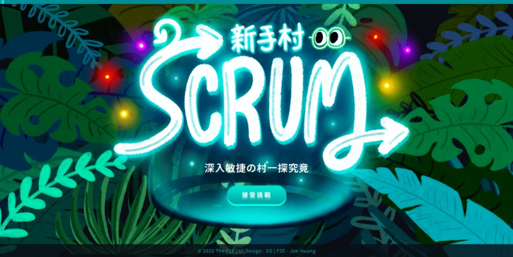

# The F2E Week 3 - Scrum 新手村

The F2E 4th 官網 redesign。

[💻 Live Demo]()

[🎨 Design provider](https://2022.thef2e.com/users/12061549261454740203)

## 作品說明

✨ Scrum 新手村小遊戲！透過簡單的拖曳小遊戲，讓不懂 Scrum 的新手可以快速了解 Scrum 流程。



-   使用 React-beautiful-dnd 做出拖曳元件交換元件的效果。
-   使用 Framer motion 做出符合 UI 設計的動畫。

## 資料夾說明

```

src
 |_animation - 動畫設定
 |_assets - 圖檔、字體
 |_components - React 元件
 |_constants - 常數
 |_hooks - customer hook
 |_layouts - 共用 layout
 |_pages - 畫面
 |_shared - 共用樣式、圖片
 |_utils - 通用函數

```

## 使用技術

-   [React](https://reactjs.org/) - JS library.
-   [Styled Components](https://styled-components.com/) - For styles.
-   [Framer Motion](https://www.framer.com/motion/) - For animation.

## 第三方服務

-   [React Beautiful Dnd](https://github.com/atlassian/react-beautiful-dnd) - For element drag and drop.
